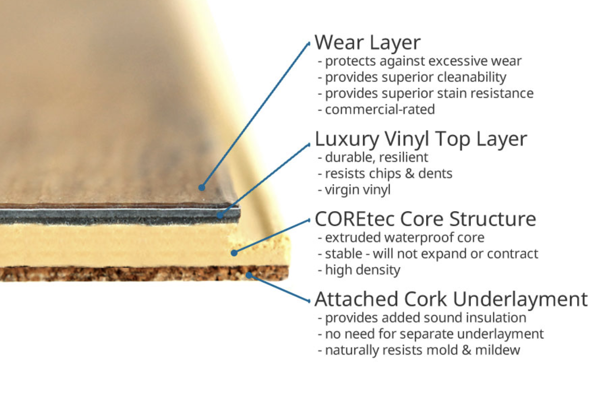

> Table of Contents

- [Interior](#interior)

## Buying the Van

#### How much are you asking and is it negotiable?

Asking price is `$64,500`, firm.

We think that price is a pretty sweet value already for all the features this van has, and we dislike the awkwardness of negotiating for things. The price includes all the equipment below.

---

#### What's included?

The vehicle itself, plus lots of gear specifically selected for use on the open road. This includes:

- Hand-made quilted magnetic window covers for the "house" part of the van
- Vehicle-specific sun screens for the windshield and front windows
- Two top-of-the-line induction cooktops, plus 2 compatible frying pans
- A remote-ready workstation, including an HD monitor, laptop mount, and double monitor arm (which we also used as a TV for gaming and movies)
- A Weboost Antenna, for excellent cell service while in the van
- Custom-made couch/bed cushions
- 2 collapsible camping chairs
- A collapsible electric kettle
- Equipment for managing and cleaning the composting toilet
- so much more!

---

#### I want to come see the van!

Due to the pandemic, all initial showings will be done over Zoom or Facetime.

Once you get serious about purchasing the van, we can organize an in-person showing/test drive here in the SF Bay Area.

---

#### Can I buy the van today?

Yes! We're ready to hand over the keys as soon as the transaction is complete ([see below]() for more info about that process)

---

#### Will you deliver the van?

We can deliver it anywhere in the greater SF Bay Area. We have some limited availability to take it farther, but there would be an additional charge for that.

---

#### Do you have financing options? Do you accept trades?

Nope, we will only accept full cash payment for the van. No trades, payment plans, or copious amounts of candy will be considered.

There are plenty of options for financing out there! We've used [Nerdwallet](https://www.nerdwallet.com/blog/loans/best-car-loans-for-good-fair-and-bad-credit/) before and liked it quite a bit. They can give you a handful of estimates based on a soft credit check.

---

#### What state is the van registered in? Is it an RV or Auto?

The van is registered in Texas. It's got a regular auto title.

---

#### Does the title have a lien on it?

Nope! The title is clean and in my (David's) name. I've got the original document that I'm ready to hand to the new owner.

---

#### How do we pay you?

We'll conduct the transaction using Escrow.com. This is for a few reasons:

- This provides a layer of security handling a large amount of cash for you the buyer & us the seller. Read about their process [here](https://www.escrow.com/what-is-escrow).
- It will greatly speed up the money transfer process.
- We're more than happy to cover the final sale Escrow.com fees (~\$500). **Note** that Escrow.com requires the buyer to cover fees if you back out/withdraw funds.

---

#### Can you give us a step-by-step of the Escrow.com process?

Absolutely! It's quite painless.

1. You express your firm intent to buy the van
1. We'll create a "transaction" on the site at the agreed upon price
1. You'll initiate a wire transfer from your bank to the escrow.com account. Note that your bank may charge you a small fee for this service (ours was ~\$20)
1. Notify us once it's cleared. They'll send you an email
1. We'll meet in person. We'll go on the site and mark the van as "shipped" and you'll then mark it as "received"
1. We'll sign over the paper title and hand you the keys.
   You'll drive off into the sunset!

Here are some general links:

- [General Escrow Instructions](https://www.escrow.com/escrow-101/general-escrow-instructions)
- [Escrow.com Payment Options and addresses](https://www.escrow.com/support/payment-options)

## Van Specs

#### What's the make/model/year?

The van is a Dodge ProMaster 2017

- High roof
- 159" wheelbase
- Gasoline engine, 3.6L
- Front-wheel drive

---

#### How many miles are on the van?

As of July 1, 2020, the van has X miles on it, most of which were picked up on the interstates. We've spent most of our time in cities, plus a bit of time camping.

---

#### What condition is the vehicle in?

The van has had regular oil changes and tire rotations, as well as all the scheduled warranty inspections. The vehicle itself is still the original, off-the-factory-line parts.

The only major damage we've had was to the plastic on the back of the passenger mirror. It got cracked in the middle of the night while we were asleep. We patched it up well the next morning. It's also a pretty cheap replacement part if you want it done for real (aka without duct tape).

---

#### Are you the original owners?

Nope, but we purchased the van from the original owners (and builders).

---

#### Is the van still under factory warranty?

Yes. It's got an extended Powertrain Warranty, and that's good for 60 months (expiring 2022-11-20) or 60,000 miles, whichever comes first. It stays with the van when we sell it to you.

---

#### How tall/long is the van? Can you park it anywhere?

The van fits in just about any old regular parking space, and is relatively easy to parallel park. The clearance makes it hit or miss with low clearances structures like drive-thrus and parking garages.

- Length: 19’ 8” bumper to bumper
- Width: 6’ 9” (mirrors in), 8’ 10” (mirrors out)
- Clearance: 9’ 4” (highest point WeBoost & open MaxxAir)

We've parked and driven around Chicago, New Orleans, and Los Angeles without issue.

---

#### What kind of gas mileage does the van get? How far can it go?

We averaged 17mpg overall, most of which was on the highway. Less in the city, but we didn't keep track closely.

The tank is 24 gallons, so you can go 250 miles in a city and ~ 400 miles on a road trip.

---

#### What's the weight rating & gross weight of the van?

We didn't measure it directly, but the previous owners told us this:

The weight ratings for the 2017 RAM ProMaster 2500 are...

- GWAR (front): 4629 lbs.
- GWAR (rear): 5291 lbs.
- GVWR (total): 8900 lbs.

[They] had the van weighed on a CAT scale (per axle) and by RVSEF (per wheel). Both weigh-ins were done with us in it + personal belongings + a full 24 gallon gas tank + a full 7 gallon freshwater tank.

CAT results (Jan. 5th, 2019, accurate to 10lb. increments)
Front axle: 4020 lbs. (609 lbs. under GWAR)
Rear axle: 3740 lbs. (1,551 lbs. under GWAR)
Total: 7760 lbs. (1,140 lbs. under GVWR)

- RVSEF results (Jan 23rd, 2019, scales accurate to 100lb. increments)
- Front Driver: 2100 lbs.
- Front Passenger: 2100 lbs.
- Rear Driver: 1900 lbs.
- Rear Passenger: 1800lbs.
- Total: 7900 lbs.

* GWVR is less than both GWARs added intentionally by manufacturer because vehicles over 9000 lbs require special licensing. So the real GVWR is more like ~9920 lbs.

---

#### What was your auto insurance like?

We insured it with State Farm as an RV. This covered both the cost of the vehicle itself, plus all of the build & fixtures. We paid ~$800 for 12 months of coverage. We also had cheap renter's insurance to cover our personal belongings (~$100 / 12 months)

---

## Interior

#### What's the bed/table situation?

The bed is made up of 5 cushions. These cushions were cut and created by friendlyfoam.com and are made of professional, marine grade foam. When the table is up they form the seating area, and then when the table goes down, they comprise the bed.

We store our bedding in the bench underneath the bed when the table is up.

The bed sleeps left-right and measures 66" head-to-toe (across the width of the van) and 48" wide (front-to-back in the van). This is a few inches shy of a "full" mattress and it can fit two average height people. David slept a little bit diagonally and Vicky could sleep whichever direction she wanted.

The table (room enough for 2-4 people, laptops etc.) sits on an easy to use [Springfield Marine Pedestal](https://www.westmarine.com/buy/springfield--12-28-anodized-air-powered-3-stage-table-pedestal--17075045?recordNum=1).

**About the bed cushions**: They are not your basic "oh we cut this up ourselves from a piece of foam off amazon'' foam. They are high density professional quality foam - what that means, is that you can sit on these foam cushions and your butt is not coming close to the wood underneath it and they should last for quite some time.

Is it comfy? Quite! The cushions are firm and we do suggest using a mattress protector/softer foam on top + bed sheets. We're pretty picky about mattresses and we found the bed extremely comfy.

---

#### How much water does the van hold?

The van contains two 7 gallon water containers:

1. The fresh water one can be filled from most water fill stations (we usually used Prima water stations, found all over the country at grocery stores. It costs ~\$3 for 7 gallons of fresh water).
2. The gray water that collects used water from the sink.

The water is pumped through the pipes to the sink by an Shurflo electric pump and accumulator.

And don't worry - the sink itself is big enough to wash your pots and pans!

---

#### Is it easy to cook in?

## Electrical

#### What's the electrical setup like?

The house battery charges two ways:

1. 600W of solar panels on the roof
2. [Sterling battery-to-battery charger](https://www.sterling-power-usa.com/sterlingpower12volt-to-24volt-70ampbatterytobatterycharger.aspx) that cranks out 800w when the van is running

The house battery supplies power to:

1. 24V distribution panel that powers the lights & fans (w/ 2 USB outlets as well)
2. a 2000W (6000W surge) AIMS inverter/charger, which power (6!) different 120V wall outlets in the van (2 under the bed, 2 around the standing desk area, and 2 under the sink)

The house battery itself is a 24V "DIY Telsa Powerwall" lithium-ion battery (more on that in it's own FAQ). It has a 100 amp capacity (aka 200 amps in the 12V world, or about 2.5kWh of energy). It can safely go from 100% to 0%, so that's a TRUE 100 amps without having to worry about harming the battery.

The whole setup is monitored with a [SBMS120](https://electrodacus.com/). This thing is a freaking sweet little piece of technology that's a 2-in-1 charge controller and lithium BMS. It also has cool graphs to display energy in & out, and has tons of options to configure how it charges and balances the battery if you wanna get really geeky with it.

#### How is the lighting?

Our lights are 24V LED RGBW strips. They can show any color, plus white. They also have a dimmer, which is great for any time of day. You can control them via both a remote control and a touch panel mounted by th bed.

There are two separate "banks" of lights:

1. one receiver controls the 3 upper lights - above the sliding door, above the kitchen counter, and above the RV window
2. another receiver controls the 2 "movie theater" lights affixed under the lip of the counters (these are super handy for stealth camping!)

---

#### I'm not super techy, is the electrical hard to manage?

Not at all! The system is pretty dialed in, so you don't have to worry about much of anything. We haven't had to adjust anything in the system for the entire time we've owned the van.

Not only will we show you around some of the basics when you tour the van, we can provide you with an exhaustive detailed video manual for it AND we're going to be available via email or phone to help you troubleshoot anything electrical for as long as you own it!

---

#### A DIY battery? Is that safe?

From the previous owners/builders:

> Yes, we literally MADE our battery. It was a crazy intense project but we're super proud of it, and it's been running strong and powering everything in the for over a year now!

> It was made out of 420 "18650" cells recycled out of used computer batteries. If you Google "DIY Tesla Powerwall" and watch some videos you can find some people that power their whole houses with these things!

> Each cell was thoroughly tested and selectively chosen, so they should still have a good amount of health left in them. Plus each individual cell has a tiny fuse on it that will keep it safe from overheating due to dangerous electrical currents.

---

### What happens if the recycled battery starts to die?

There no signs of this happening so far! But, all batteries lose capacity over time. Even still, the battery should remain safe to use even as individual cells & packs begin to fade.

Once the battery capacity reaches a point where it doesn't give you the energy you need, a replacement would be a pretty easy weekend project. All you would have to do is get [(8) 3.2v LiFePo4 battery packs like these](https://www.alibaba.com/product-detail/Storage-Battery-LiFePO4-3-2V-100Ah_60740880420.html?locphyscl=9061288&pla_localcode=&pla_country=US&pla_prdid=60740880420&src=sem_ggl&src=sem_ggl&adgrp=63830955303&cmpgn=1675096474&pla_group=293946777986&ntwrk=g&pla_lang=en&gclid=EAIaIQobChMI_s6hhsTD4QIVwRd9Ch3NGAWZEAQYBSABEgL_WfD_BwE&dvcmdl=&pla_adtype=pla&pla_channel=online&position=1o5&pla_mrctid=129192408&device=c&mark=google_shopping&mark=shopping&locintrst=#shopping-ads) (or something like them) and swap them out with the (7) 3.7v DIY ones in there now. We (and the original owners) are happy to lend advice when that time comes.

## Build Details

#### Is it well-insulated? Does it stay cool and comfortable?

Yes. This van does a great job of staying at a comfortable temperature - all year around. We have traveled in hot summers, cold winters, and everything in between - the van is built to keep comfortable (and dry!).

The van is insulated in all the walls with rigid foam board and the all-around curtains do wonders at blocking hot/cold air drafts.

There's also a roof-mounted [Maxx Air Deluxe Fan](https://www.amazon.com/Maxx-Air-00-07500K-MaxxFan-Deluxe/dp/B002OW5JG2/ref=sr_1_2?keywords=maxxair+deluxe&qid=1554259083&s=gateway&sr=8-2). It has a remote for easy control as well as a temperature monitor option so it will switch on automatically if it gets too warm. It can suck air out (great for cooking, etc..) and in (great for keeping a constant breeze in the space).

The only truly uncomfortable sleeping experience we had was a heat wave in the Chicago summer. We were trying to be extra stealthy with the windows closed, but it got way too warm. A cross breeze definitely helped, but at some point there's only so much you can do.

---

#### What's the floor made out of?

The floor is made entirely of high-quality [COREtec Plus 5" Waterproof Vinyl Planks](https://www.flooringinc.com/vinyl/planks/usfloors-coretec-plus.html). They're completely watertight/proof with a cork underlayment.

It's great for walking around in socks when it's chilly and easy to clean! You'll absolutely feel the difference between this and lower quality flooring.

## Lifestyle

#### How easy is stealth camping?

Incredibly easy. There are blackout curtains for every window and a ton of sound dampening. We've tested Netflix at full volume with the window open and you can't hear it at all until you're a foot from the window. It's pretty spectacular.

The van itself is white and generic, so you don't stick out on a residential street (where we spent most of our time).

---

#### What are the other parking options?

When we weren't stealth camping in cities we were either at state/local campgrounds or [Harvest Hosts](https://harvesthosts.com/about).

Campgrounds are great because they've got all the amenities a traveler needs: water, dump stations, peace & quiet.

Harvest hosts is a paid membership program that allows travelers to stay at wineries, breweries, and farms all across North America. These are typically super pretty and welcoming, definitely an upgrade from Wal-Mart.

---

#### Why is this the perfect van for digital nomads?

Absolutely!

The van was built to support 2 people working full-time as they travel, which is exactly how we used it. While we didn't spring for wifi in the van, the previous owners did. They used a monthly plan through [Unlimitedville](https://unlimitedville.com/) and they loved it.

Some features that make this awesome for the digital nomad life:

- Large table with comfortable seating big enough to handle 2 laptops plus keyboards and dongles
- Standing desk option with movable arms for a monitor and laptop holder (both included with van)
- WeBoost 4G-X package to boost your reception wherever you go
- Swivel Seat (for when you're working near the ocean)
- Ample solar to power all your devices + charge the battery during the workday.
